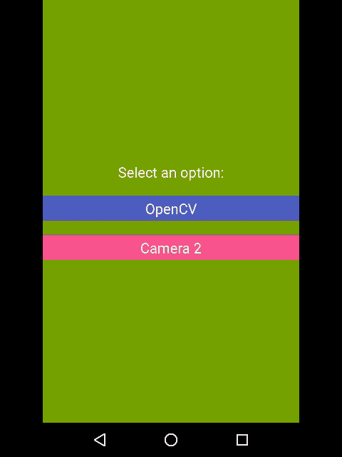

# Face Recognition samples with Augmented Reality (AR)
[](http://www.apache.org/licenses/LICENSE-2.0)
[](http://developer.android.com/index.html)

This sample app supports *Quest of a Hero* presentation
as well as it has two different possibilities to make face detection and recognition.
The first one is *OpenCV* based and the second one is by means of *Camera 2 API*
This sample supplies few Augmented reality things.

### Screenshots



### Features
- _Sample 1_ uses *OpenCV* with its camera widget, in addition to detecting face or eyes as well as rendering basic graphics to show areas recognised.
- _Sample 2_ uses *Camera 2* for camera stream (using a TextureView for the preview), face detection and recognition. Then it uses a View with Canvas to render the augmented reality object.

### SDK support
Support SDKs from **21** to **25**

# Disclosure - Libraries used
- [OpenCV 3.2.0](http://docs.opencv.org/trunk/d5/df8/tutorial_dev_with_OCV_on_Android.html) by OpenCV
- [Camera 2 API](https://developer.android.com/reference/android/hardware/camera2/package-summary.html) by Google

# References:
- [Tutorial of OpenCV](http://www.learnopencv.com/image-recognition-and-object-detection-part1/) by Satya Mallick
- [OpenCV for Secret Agents](https://www.packtpub.com/application-development/opencv-secret-agents) by Joseph Howse
- [Android Camera 2 Basic](https://github.com/googlesamples/android-Camera2Basic) by Google

## About the author
**Raul Hernandez Lopez**,
- [Insights and projects (Personal projects blog)](https://raulh82vlc.github.io/)
- [@RaulHernandezL (Twitter)](https://twitter.com/RaulHernandezL)
- [raul.h82@gmail.com](mailto:raul.h82@gmail.com)

# License
```
Copyright (C) 2017 Raul Hernandez Lopez

Licensed under the Apache License, Version 2.0 (the "License");
you may not use this file except in compliance with the License.
You may obtain a copy of the License at

http://www.apache.org/licenses/LICENSE-2.0

Unless required by applicable law or agreed to in writing, software
distributed under the License is distributed on an "AS IS" BASIS,
WITHOUT WARRANTIES OR CONDITIONS OF ANY KIND, either express or implied.
See the License for the specific language governing permissions and
limitations under the License.
```
