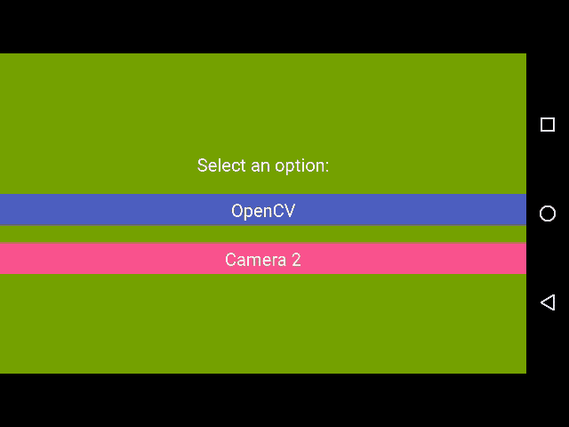

# Face Detection samples with Augmented Reality (AR)
[](https://travis-ci.org/raulh82vlc/ImageRecognitionSamples)
[](http://www.apache.org/licenses/LICENSE-2.0)
[](http://developer.android.com/index.html)

This sample app is basically made to support the following talks:
- [Building a *"Minimum Viable Product"* (MVP) with *Face recognition* and *AR* in Android @ **Droidcon London 2017**](https://speakerdeck.com/raulh82vlc/building-a-minimum-viable-product-mvp-with-face-recognition-and-ar-in-android-at-droidcon-london-2017)
- [Quest of a hero presentation slides @ Londroid April 2017](https://speakerdeck.com/raulh82vlc/quest-of-a-hero-at-londroid-april-2017) presentation

### Pre requirements to play the sample apps
- For OpenCV you will need to install the OpenCV manager prior to execute this OpenCV sample on your device or making an in app native OpenCV installation with the .so file.
- I would fairly suggest to start Camera 2 sample first to allow camera permissions on your device, since OpenCV is looking for both permissions and OpenCV library, might fail at some point if there is a race condition.
- Last suggestion, don´t use any emulator for those sample apps, it is a camera specific project, it does not work well with emulators.

### Screenshot of Use case 1


### Screenshot of Use case 2


### Features
- _Use case 1_ uses *OpenCV* with its camera widget, in addition to detecting face or eyes as well as rendering basic graphics to show areas recognised.
- _Use case 2_ uses *Camera 2* for camera stream (using a TextureView for the preview), face detection. Then it uses a View with Canvas to render the augmented reality object.

### SDK support
Support SDKs from **21** to **25**

# Disclosure - Libraries used
- [OpenCV 3.2.0](http://docs.opencv.org/trunk/d5/df8/tutorial_dev_with_OCV_on_Android.html) by OpenCV
- [Camera 2 API](https://developer.android.com/reference/android/hardware/camera2/package-summary.html) by Google

# References
- [Tutorial of OpenCV](http://www.learnopencv.com/image-recognition-and-object-detection-part1/) by Satya Mallick
- [OpenCV Face detection sample app](https://github.com/opencv/opencv/tree/master/samples/android/face-detection) by OpenCV
- [OpenCV for Secret Agents](https://www.packtpub.com/application-development/opencv-secret-agents) by Joseph Howse
- [Android Camera 2 Basic sample app](https://github.com/googlesamples/android-Camera2Basic) by Google

### Remarks
- This is not a finished app, and it is only made for supporting presentations content.
- Don´t expect to have complete functionalities or being error proof. For this you would need to contribute to the sample app or creating a brand new project with further support on other devices. It is only checked on Nexus 5 phone for instance.

### Contributions
Please read first [CONTRIBUTING](./CONTRIBUTING.md)

## About the author
**Raul Hernandez Lopez**,
- [Insights and projects (Personal projects blog)](https://raulh82vlc.github.io/)
- [@RaulHernandezL (Twitter)](https://twitter.com/RaulHernandezL)
- [raul.h82@gmail.com](mailto:raul.h82@gmail.com)

# License
```
Copyright (C) 2017 Raul Hernandez Lopez

Licensed under the Apache License, Version 2.0 (the "License");
you may not use this file except in compliance with the License.
You may obtain a copy of the License at

http://www.apache.org/licenses/LICENSE-2.0

Unless required by applicable law or agreed to in writing, software
distributed under the License is distributed on an "AS IS" BASIS,
WITHOUT WARRANTIES OR CONDITIONS OF ANY KIND, either express or implied.
See the License for the specific language governing permissions and
limitations under the License.
```
